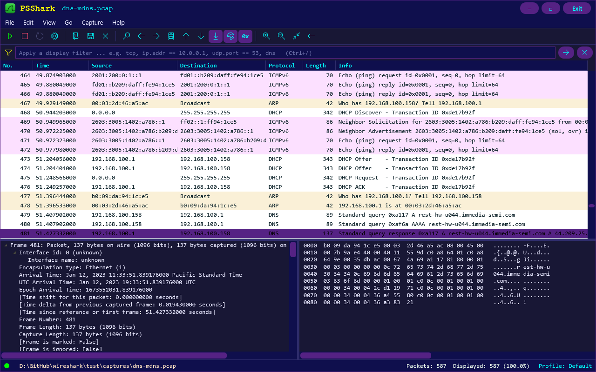
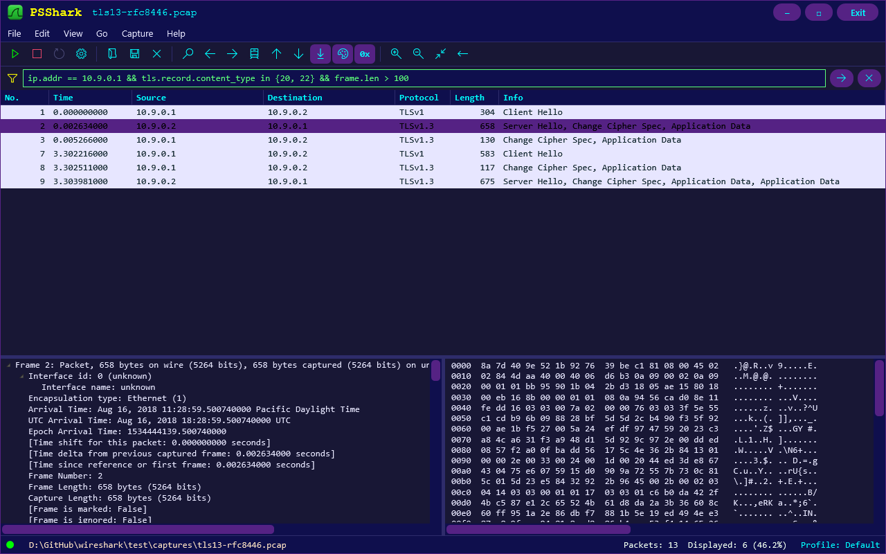
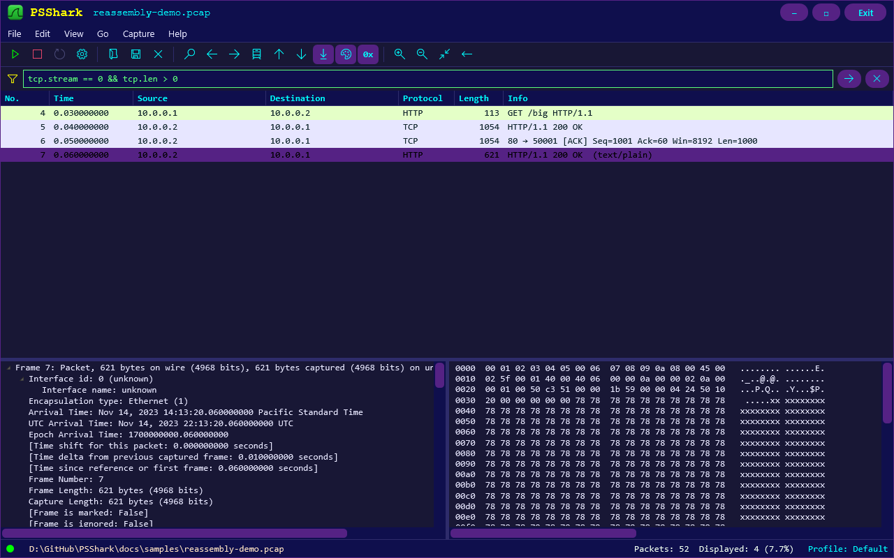

# PSShark

**A Wireshark-style packet capture viewer written in PowerShell (WPF + runspaces).**

PSShark captures live network traffic on Windows, reads and writes capture files, and shows every packet the way
Wireshark does: a colour-coded packet list, a protocol decode tree and a hex/ASCII pane. It ships as **one
all-in-one script** (`PSShark.ps1`): the PowerShell UI, an embedded C# packet-decoding core, the XAML and the
application icon are all inside that single file.

| | |
|---|---|
| **Version** | 1.0 |
| **Platform** | Windows 10 / 11, Windows PowerShell 5.1 or PowerShell 7+ |
| **Live capture** | Built-in `NetEventPacketCapture` module (needs Administrator) |
| **Capture files** | Reads pcap and pcapng, writes pcap, exports pktmon-style text |



---

## Contents

1. [Features](#1-features)
2. [Requirements](#2-requirements)
3. [Getting started](#3-getting-started)
4. [User guide](#4-user-guide)
5. [The filter language](#5-the-filter-language)
6. [Design and architecture](#6-design-and-architecture)
7. [How it was verified](#7-how-it-was-verified)
8. [Limitations](#8-limitations)
9. [Developer notes](#9-developer-notes)
10. [Troubleshooting](#10-troubleshooting)
11. [Repository layout](#11-repository-layout)

---

## 1. Features

### Capture and files

- **Live capture** through the `NetEventPacketCapture` module (a real-time ETW consumer), with Start, Stop, Restart
  and a Capture Options dialog (interface list with IPv4 address, promiscuous mode).
- **Capture filter:** optionally drop non-matching packets while capturing, using the same filter language as the
  display filter. Dropped packets are never stored and never numbered.
- **Open** pcap (little/big endian, microsecond/nanosecond) and pcapng files, including files saved by Wireshark.
  Drag and drop a file onto the window to open it.
- **Save** as pcap that Wireshark opens directly (nanosecond timestamps).
- **Export text:** every row in the table as a `pktmon etl2txt`-style log (see [4.9](#49-saving-and-exporting)).

### Display

- Wireshark layout and menus: **File, Edit, View, Go, Capture, Help** (Analyze, Statistics, Telephony, Wireless
  and Tools are intentionally not implemented), toolbar and display-filter bar.
- Packet list columns in Wireshark order: **No., Time, Source, Destination, Protocol, Length, Info**, coloured with
  Wireshark's default colouring rules. Source and Destination are IP addresses only: **no DNS lookups** are made.
- **Protocol decode tree** in Wireshark's format, with byte ranges: click a node and its bytes are highlighted in the
  hex/ASCII pane. The bytes pane can be hidden, and the tree then uses the full width.
- **Right-click copy** of source/destination MAC and IP addresses from the details pane.
- Status bar with packet counts, the selected interface (with IPv4 address) and a live "received / dropped" counter.
- Resizable window with dark themed scroll bars everywhere, zoom in/out, auto-scroll during live capture.

### Decoding

- **Protocols:** Ethernet II, 802.3/LLC/SNAP, 802.1Q VLAN, ARP, STP, IPv4, IPv6 (with extension headers), ICMP,
  ICMPv6, IGMP, TCP, UDP, DNS (over UDP and TCP), mDNS, LLMNR, DHCP, SSDP, NTP, HTTP/1.x, TLS (records, handshake
  names, SNI, TLS 1.3 detection) and minimal 802.11 labelling.
- **TCP analysis:** relative sequence/acknowledgement numbers, window scaling, SACK, keep-alive, retransmission and
  "previous segment not captured" notes.
- **TCP reassembly** for HTTP, TLS records and DNS over TCP, presented exactly the way Wireshark presents it.

### Filtering

- A real parser (tokenizer and grammar) for a large subset of Wireshark's display-filter language: **169 typed
  fields**, comparison operators, `contains`, `matches` (regex), `in {...}` sets and ranges, bit tests, byte slices,
  CIDR, `any`/`all` quantifiers and parentheses.
- **Live syntax checking:** the filter box turns green when the expression is valid and red when it is not. Applying
  an invalid filter shows a dialog that says what is wrong and where, with "did you mean" suggestions.

### Engineering

- **Never freezes:** capture, file loading, dissection and saving all run on background runspaces. The UI thread only
  drains queues in short time slices.
- **All-in-one:** a single script file with an embedded, green-recoloured application icon.
- **Fast:** about 55,000 packets per second when loading, a filter over 410,000 packets in 30 to 230 ms, a text export
  at over 300,000 packets per second.

---

## 2. Requirements

| Requirement | Details |
|---|---|
| Operating system | Windows 10 or Windows 11 (WPF is Windows-only) |
| PowerShell | Windows PowerShell 5.1 **or** PowerShell 7+ (both are tested). The script relaunches itself with `-STA` when WPF needs it |
| Live capture | The built-in `NetEventPacketCapture` module and an **elevated (Administrator)** session |
| Capture files | No special rights needed |
| Nothing else | No Npcap, no Wireshark, no third-party modules or DLLs |

Wireshark's `tshark` and Windows' `pktmon` are used only by the developer to verify results (see
[section 7](#7-how-it-was-verified)); they are not needed to run PSShark.

---

## 3. Getting started

### 3.1 Start PSShark

```powershell
# from a normal PowerShell window (viewing and saving files works without admin rights)
pwsh -File .\PSShark.ps1

# open a capture file straight away
pwsh -File .\PSShark.ps1 .\capture.pcapng

# keep the console window visible (useful when something goes wrong)
pwsh -File .\PSShark.ps1 -ShowConsole
```

Use `powershell.exe` instead of `pwsh` for Windows PowerShell 5.1. If the script was downloaded and PowerShell
refuses to run it, either run `Unblock-File .\PSShark.ps1` once or start it with
`-ExecutionPolicy Bypass`.

If PSShark is started without Administrator rights it shows a notice with three choices:

| Button | What happens |
|---|---|
| **Restart as Administrator** | Relaunches PSShark elevated (Windows asks for confirmation) |
| **Continue** | Carries on; opening, viewing, filtering and saving files all work |
| **Exit** | Closes PSShark |

### 3.2 Look at a capture file (2 minutes)

1. **File > Open...** (Ctrl+O) and choose a `.pcap` or `.pcapng` file. A small demo capture is included:
   `docs/samples/reassembly-demo.pcap`.
2. Click a row in the packet list: the decode tree and the bytes appear underneath.
3. Type `tcp.stream == 0 && tcp.len > 0` in the filter bar and press **Enter**.
4. Right-click a line such as `Ethernet II, Src: ..., Dst: ...` in the details pane to copy an address.

### 3.3 Capture live traffic

1. Start PSShark **as Administrator**.
2. **Capture > Options...** (Ctrl+K), select the interface, optionally tick *promiscuous mode* and *Only capture
   filtered packets*, and click **Start**. The capture begins immediately.
3. Watch the packet list fill. **Capture > Stop** (Ctrl+E) ends the capture.
4. **File > Save As...** to keep the packets, for example as a `.pcap` file for Wireshark.

Packets are held in memory only; PSShark writes no temporary files. If you close the program or start a new capture
with unsaved packets it asks before discarding them.

---

## 4. User guide

### 4.1 The main window

```
+----------------------------------------------------------------------------------+
|  logo  PSShark   *Ethernet 2 (192.168.1.5) (unfiltered)          [-] [ ] [Exit] |  title bar
+----------------------------------------------------------------------------------+
|  File  Edit  View  Go  Capture  Help                                             |  menu bar
|  [>] [#] [R] [o] | [Open] [Save] [x] | [find] [<] [>] ... [0x] | [+] [-] [ ]     |  toolbar
|  [Y] Apply a display filter ...                                    [->] [x]      |  filter bar
+----------------------------------------------------------------------------------+
|  No.  Time       Source        Destination    Protocol  Length  Info             |
|  ...  (packet list, colour coded, scrolls)                                       |
+-------------------------------------------+--------------------------------------+
|  Packet details (protocol decode tree)    |  Packet bytes (hex and ASCII)        |
+-------------------------------------------+--------------------------------------+
|  o Ready...   Interface: ...              Packets: N  Displayed: M  Profile: ... |  status bar
+----------------------------------------------------------------------------------+
```

The window can be resized and maximised; the splitters between the three panes can be dragged.
Every pane that can overflow has a scroll bar.

### 4.2 Menus

| Menu | Items |
|---|---|
| **File** | Open (Ctrl+O), Save (Ctrl+S), Save As (Ctrl+Shift+S), Close (Ctrl+W), Quit (Ctrl+Q) |
| **Edit** | Copy Packet Summary (Ctrl+Shift+C), Find Packet (Ctrl+F), Find Next (Ctrl+N / F3), Find Previous (Ctrl+B / Shift+F3) |
| **View** | Packet Details, Packet Bytes, Zoom In / Out / Normal (Ctrl++ / Ctrl+- / Ctrl+0), Resize All Columns (Ctrl+Shift+R), Expand All (Ctrl+Right), Collapse All (Ctrl+Left), Auto Scroll in Live Capture, Colorize Packet List |
| **Go** | Go to Packet (Ctrl+G), Previous (Ctrl+Up), Next (Ctrl+Down), First (Ctrl+Home), Last (Ctrl+End) |
| **Capture** | Options (Ctrl+K), Start / Stop (Ctrl+E), Restart (Ctrl+R) |
| **Help** | About PSShark |

Other shortcuts: **Ctrl+/** moves the focus to the filter bar; **Enter** in the filter bar applies the filter.

### 4.3 Toolbar

| Group | Buttons |
|---|---|
| Capture | Start, Stop, Restart, Options |
| Files | Open, Save, Close |
| Navigate | Find, Previous, Next, Go to Packet, First, Last |
| View toggles | Auto scroll, Colorize, **`0x` show/hide the packet bytes pane** |
| Zoom | Zoom in, Zoom out, Normal size, Resize columns |

### 4.4 The packet list

| Column | Meaning |
|---|---|
| **No.** | Packet number. With a capture filter, numbering counts only the packets that were kept |
| **Time** | Seconds since the first packet, with nine decimals |
| **Source / Destination** | IP addresses. Frames without IP show MAC addresses, `Broadcast`, or well-known multicast names. No DNS resolution is ever performed |
| **Protocol** | The highest protocol PSShark decoded (`TCP`, `TLSv1.3`, `HTTP`, `DNS`, ...) |
| **Length** | Frame length on the wire |
| **Info** | Wireshark-style summary, for example `443 -> 51945 [ACK] Seq=1 Ack=2 Win=255 Len=0` |

Rows are coloured with Wireshark's default rules:

| Colour | Traffic |
|---|---|
| Light purple | TCP |
| Grey | TCP SYN / FIN |
| Dark red | TCP RST |
| Black on red text | TCP problems (retransmission, missing segment) |
| Light blue | UDP (including DNS, DHCP, NTP) |
| Light green | HTTP |
| Light pink | ICMP and ICMPv6 |
| Light yellow | ARP |
| Cream | Routing protocols |

**Colorize** in the View menu or toolbar switches the colouring off. The selected row is always purple.



### 4.5 The details pane (decode tree)

Selecting a packet shows its decode in Wireshark's format: *Frame*, *Ethernet II*, *IPv4/IPv6*, *TCP/UDP*, then the
application protocol. Each node knows which bytes it covers, so clicking a node highlights them (yellow) in the
bytes pane. **Expand All / Collapse All** (View menu) open or close every node; protocol layers open automatically
when you select a packet.

**Right-click copy.** Right-clicking a line that holds addresses opens a small menu:

| Line | Menu entries |
|---|---|
| `Ethernet II, Src: a, Dst: b` | Copy source MAC, Copy destination MAC |
| `Internet Protocol Version 4/6, Src: a, Dst: b` | Copy source IP, Copy destination IP |
| `Source: ...`, `Destination: ...`, `Source Address: ...` | The one entry that applies |
| ARP `Sender/Target MAC/IP address` | The one entry that applies |
| Any other line | No menu |

The address (not its vendor or group name) is copied to the clipboard.

### 4.6 Hiding the bytes pane

The **`0x`** toolbar button (or **View > Packet Bytes**) shows or hides the hex/ASCII pane. With the pane hidden the
decode tree takes the full window width.

### 4.7 Capture options

| Option | Effect |
|---|---|
| **Interface list** | Name, description, IPv4 address, status and speed of each adapter |
| **Enable promiscuous mode** | Ask the adapter to pass all traffic it sees, not just traffic for this PC |
| **Only capture filtered packets** | Enter a filter expression (same language as the display filter). Packets that do not match are dropped and never stored; kept packets are numbered from 1 and time zero is the first kept packet |

**Start** in the dialog begins the capture at once. The choice is remembered, so the toolbar triangle and Ctrl+E
reuse it. The filter box is coloured red or green while you type; an invalid capture filter is refused with an
explanation.

### 4.8 Title bar and status bar

The **title bar** shows the source and whether a filter is in effect:

| Title | Meaning |
|---|---|
| `*Ethernet 2 (unfiltered)` | Live capture (or its stopped result), no filter |
| `*Ethernet 2 (filtered)` | The capture filter was used, **or** a display filter is applied |
| `capture.pcap` | An opened file |

The **status bar** shows the state (a green dot means ready or capturing), the selected interface with its IPv4
address, and while capturing: `received` (packets delivered by the driver), the active capture filter and how many
packets were `dropped` by it. On the right: `Packets` (all in memory) and `Displayed` (rows passing the display
filter).

### 4.9 Saving and exporting

**File > Save As** offers two types:

| Type | Content |
|---|---|
| **pcap** (`*.pcap`) | **All** packets, classic pcap with nanosecond timestamps. Wireshark opens it directly |
| **Text** (`*.txt`) | The rows **currently in the table** (so an active display filter applies), in a `pktmon etl2txt` style |

The text export looks like this:

```
[ 0]0000.0000::2023-01-12 11:33:51.819746000 [Microsoft-Windows-PktMon] PktGroupId 281474976711135, PktNumber 479, Appearance 1, Direction Rx , Type Ethernet , Component 1, Edge 1, Filter 1, OriginalSize 89, LoggedSize 89
	B0-09-DA-94-1C-E5 > 00-03-2D-46-A5-AC, ethertype IPv4 (0x0800), length 89: (tos 0x0, ttl 64, id 18227, offset 0, flags [DF], proto UDP (17), length 75)
	    192.168.100.158.56236 > 192.168.100.1.53: 41239+ A? rest-hw-u044.immedia-semi.com. (47)
```

Each packet has a header line (local timestamp, packet number, direction, sizes) followed by the packet decoded in
tcpdump notation: raw TCP sequence numbers, `Flags [S.]`, DNS in tcpdump form, text for ICMP, ARP and IGMP, HTTP text
lines and hex dumps for anything else. `Direction` is `Tx` or `Rx` for live captures and `Rx` for files. A text
export is **not** counted as saving the capture: the "unsaved packets" warning stays.

Saving runs on a background runspace with a progress bar, so the window stays responsive.

### 4.10 TCP reassembly

When an HTTP message, a TLS record or a DNS-over-TCP message is split across several TCP segments, PSShark shows it
the way Wireshark does:

| Segment | What the packet list shows |
|---|---|
| First segment | HTTP: protocol `TCP` with the first line as Info. TLS: the TLS version (or `SSL`) with an empty Info |
| Middle segments | Ordinary TCP rows |
| **Last segment** | The whole message decoded: protocol `HTTP`/`TLS`/`DNS` and the message's Info |

In the details pane the last segment has a `[3 Reassembled TCP Segments (2567 bytes): #5(1000), #6(1000), #7(567)]`
entry and earlier segments say `[Reassembled PDU in frame: 7]`. Several messages in one segment are listed together
(`GET /a HTTP/1.1 GET /b HTTP/1.1`), out-of-order segments are held until the gap fills, and the filter fields
`tcp.reassembled_in`, `tcp.reassembled.length` and `tcp.segments` are available.



---

## 5. The filter language

The same language is used by the **display filter** bar and the **capture filter** in Capture Options.

### 5.1 Syntax at a glance

| Element | Examples |
|---|---|
| Protocol names | `tcp`, `dns`, `http`, `tls`, `arp`, `icmp`, `ipv6` |
| Comparisons | `ip.ttl > 60`, `tcp.port == 443`, `frame.len <= 100`; word forms `eq ne gt lt ge le` |
| Text | `dns.qry.name contains "google"` (case-sensitive), `http.host matches "^www\."` (regex, case-insensitive) |
| Sets and ranges | `tcp.port in {80, 443, 8000..8080}`, `ip.addr in {10.0.0.0/8 192.168.0.0/16}` |
| Addresses | `ip.addr == 10.0.0.1`, `ip.src == 192.168.1.0/24`, `ipv6.addr == fe80::/10`, `eth.addr == aa:bb:cc:dd:ee:ff` |
| Bit tests | `tcp.flags & 0x12 == 0x12`, `eth[0] & 1` |
| Byte slices | `eth.src[0:3] == 00:11:22`, `tcp[13] == 0x18`, `frame[0] == 0xff`, `tcp.payload[0:2] == 47:45` |
| Field vs field | `ip.src == ip.dst`, `tcp.srcport == tcp.dstport` |
| Boolean fields | `tcp.flags.syn`, `!ip.flags.df` |
| Quantifiers | `all tcp.port > 1024`, `any ip.addr != 1.1.1.1`, `tcp.port === 443`, `tcp.port !== 443` |
| Combining | `&&` `and`, `\|\|` `or`, `^^` `xor`, `!` `not`, parentheses |

More examples:

```text
tcp.flags.syn == 1 && !tcp.flags.ack
(tcp || udp) && !dns && ip.ttl < 10
tls.handshake.type == 1 && tls.handshake.extensions_server_name contains "example"
dns.flags.response == 1 && dns.a == 93.184.216.34
http.request.method == "POST" && http.content_length > 1000
frame contains "password"
tcp.analysis.retransmission || tcp.analysis.keep_alive
```

Semantics follow Wireshark 4: a field that occurs more than once in a packet (for example `ip.addr`, `tcp.port`) is
true if **any** instance matches; `!=` means "the field is present and **no** instance equals the value"; a field
that is absent from a packet never matches a comparison.

### 5.2 Live checking and error dialogs

The filter box changes colour as you type: **green** for a valid expression, **red** for an invalid one (hover for
the reason). Pressing Enter or the Apply button with an invalid filter does not apply it; a dialog explains the
problem, for example:

| You type | PSShark says |
|---|---|
| `tcp &&` | Missing condition after '&&' (at position 7) |
| `(tcp` | Missing ')' to close the '(' opened here (at position 1) |
| `tcp.prot == 80` | Unknown protocol or field 'tcp.prot'. Did you mean: tcp.port? |
| `ip.addr == 999.1.1.1` | '999.1.1.1' is not a valid IPv4 address for 'ip.addr' |
| `tcp.port == 70000` | '70000' is too large for 'tcp.port' (maximum 65535) |
| `tcp.port contains 5` | Operator 'contains' cannot be used with 'tcp.port' (unsigned integer) |
| `10.0.0.1` | '10.0.0.1' on its own is not a condition - did you mean ip.addr == 10.0.0.1 ? |

### 5.3 Supported fields (169)

| Protocol | Fields |
|---|---|
| **frame** | `number`, `len`, `cap_len`, `time_epoch`, `time_delta`, `time_relative`, `protocols`, `interface_name`; the whole packet as `frame` (bytes) |
| **Columns** | `_ws.col.protocol`, `_ws.col.info`, `_ws.col.source`, `_ws.col.destination` (and the alias `info`) |
| **eth** | `dst`, `src`, `addr`, `type`, `len` |
| **vlan** | `id`, `priority` |
| **arp** | `opcode`, `hw.type`, `hw.size`, `proto.type`, `proto.size`, `src.hw_mac`, `src.proto_ipv4`, `dst.hw_mac`, `dst.proto_ipv4` |
| **ip** | `version`, `hdr_len`, `dsfield`, `dsfield.dscp`, `dsfield.ecn`, `len`, `id`, `flags`, `flags.rb`, `flags.df`, `flags.mf`, `frag_offset`, `ttl`, `proto`, `checksum`, `src`, `dst`, `addr` |
| **ipv6** | `version`, `tclass`, `flow`, `plen`, `nxt`, `hlim`, `src`, `dst`, `addr` |
| **icmp / icmpv6 / igmp** | `icmp.type/code/checksum/ident/seq`, `icmpv6.type/code`, `igmp.type/maddr` |
| **tcp** | `srcport`, `dstport`, `port`, `stream`, `len`, `seq`, `seq_raw`, `nxtseq`, `ack`, `ack_raw`, `hdr_len`, `flags`, `flags.fin/syn/reset/push/ack/urg/ece/cwr/ae`, `window_size_value`, `window_size`, `window_size_scalefactor`, `checksum`, `urgent_pointer`, `payload`, `options.mss/mss_val/wscale/wscale.shift/wscale.multiplier/sack_perm/sack/timestamp/timestamp.tsval/timestamp.tsecr`, `analysis.flags/keep_alive/keep_alive_ack/retransmission`, `reassembled_in`, `reassembled.length`, `segments` |
| **udp** | `srcport`, `dstport`, `port`, `length`, `checksum`, `payload` |
| **dns** | `id`, `flags.response/opcode/authoritative/truncated/recdesired/recavail/rcode`, `count.queries/answers/auth_rr/add_rr`, `qry.name/type/class`, `resp.name/type/class/ttl`, `a`, `aaaa`, `cname`, `ns`, `ptr.domain_name`, `mx.mail_exchange` |
| **dhcp** | `type`, `option.dhcp`, `id`, `hw.mac_addr`, `ip.client/your/server/relay`, `option.requested_ip_address/hostname/dhcp_server_id` |
| **http** | `request`, `response`, `request.method/uri/version`, `response.code/phrase/version`, `host`, `user_agent`, `content_type`, `content_length` |
| **tls** | `record.content_type`, `record.opaque_type` (TLS 1.3 protected records), `record.version`, `handshake.type`, `handshake.extensions_server_name` |

---

## 6. Design and architecture

### 6.1 One file, four layers

`PSShark.ps1` is a single script. From top to bottom:

| # | Layer | What it holds |
|---|---|---|
| 1 | **Start-up** | `param` block, automatic `-STA` relaunch, console hiding, stale-build detection |
| 2 | **C# core** (`$script:csharp`, compiled with `Add-Type`) | The packet model, the dissector, the filter engine, pcap/pcapng I/O, the ETW consumer, hex dump, text export |
| 3 | **XAML** | Shared dark theme styles, the main window, a dialog shell (all embedded as strings) |
| 4 | **Application logic** | Workers, capture control, saving, the UI timer, dialogs, event wiring |

The icon is embedded as a base64 string and used for the window, the taskbar and the title bar logo. The C# is kept
compatible with the C# 5 compiler of Windows PowerShell 5.1.

### 6.2 Why compiled C# inside a PowerShell script

Per-packet work in the PowerShell pipeline is far too slow for capture rates. Everything that touches packet bytes
(decoding, filtering, file I/O) is compiled C#, loaded once with `Add-Type`; PowerShell only orchestrates. The
compiled types live in the process for its lifetime, so the script keeps a hash of its embedded source: if a session
already holds an *older* PSShark build (for example a persistent editor terminal) it restarts itself in a fresh
process instead of running stale code.

### 6.3 Threading model

The UI thread owns every WPF object. Background work runs on a `RunspacePool` (1 to 6 runspaces) created at
start-up and disposed on close. Threads communicate only through `SharedState` objects (cancel flag, progress,
error) and lock-free `ConcurrentQueue`s.

```
 capture worker  (EtwLive.Run)      ---\
                                         +--> rawQ --> parse worker --> uiQ --> UI timer (100 ms)
 reader worker   (PcapIO.Read)      ---/            (Dissector.Process)        |
                                                                                v
 writer worker   (PcapIO.Write / PktmonText.Write)             PacketStore.Drain (30 ms budget)
        ^                                                                       |
        +-- snapshot of the packets taken on the UI thread                      v
                                                                        DataGrid (virtualised)
```

- Every open or capture creates fresh queues, `SharedState` objects and a new `Dissector`, so a cancelled worker can
  finish harmlessly without touching the new session.
- The UI timer drains the queue for at most 30 ms per tick, so even a flood of packets cannot freeze the window.
- On close, PSShark waits (up to 10 s, pumping the dispatcher) for the capture worker so the capture session is
  removed properly. The session has a fixed name, so a leftover one is cleaned up at the next start.

### 6.4 Live capture

1. The capture worker creates a `NetEventPacketCapture` session in `RealtimeLocal` mode, adds the packet-capture
   provider (truncation length 65535) and the chosen adapter (optionally promiscuous), and starts it.
2. `EtwLive` (P/Invoke to `advapi32`: `OpenTraceW`, `ProcessTrace`, `CloseTrace`) consumes the session in real
   time. It accepts only complete single-event packets of the `Microsoft-Windows-NDIS-PacketCapture` provider
   (event 1001) and reads the frame from the event payload, locating the size field by checking that it equals the
   number of bytes that follow it.
3. The event's keyword bits give the media type (Ethernet, native 802.11, mobile broadband) and the direction
   (Tx/Rx). Each packet is stamped with the interface name (`\Device\NPF_{GUID}`, as Wireshark shows it) and the
   adapter's friendly name.

The ETW structures are read by fixed x64 offsets, so the consumer is 64-bit only.

### 6.5 The dissector: two passes over one code path

The decoder builds two things from the same code:

- **`Process(raw, number)`** (stateful, run once per packet **in capture order** on the parse worker) produces the
  packet-list row and remembers what later features need: layer offsets, TCP stream state (relative sequence
  numbers, window scaling, keep-alive/retransmission analysis, TLS version tracking), application values for the
  filter and reassembly buffers.
- **`BuildTree(packet)`** (stateless, run on the UI thread for the **selected** packet only) rebuilds the
  Wireshark-style detail tree with byte ranges from the stored results.

Both use one shared routine with a "build the tree" flag, so the summary line and the tree can never disagree. Any
malformed or truncated packet is caught and marked instead of stopping the pipeline.

### 6.6 The filter engine

The filter is compiled once into a predicate delegate:

```
text --> tokenizer --> recursive-descent parser --> Predicate<Packet>
                             |
                             +--> errors with position, "did you mean" (edit distance), value range checks
```

- **Field registry** (`Fields.Map`): 169 fields, each with a type (unsigned integer, boolean, IPv4, IPv6, MAC,
  string, bytes, float) and a getter that appends *every instance* of the field found in a packet. Getters read the
  packet bytes using layer offsets stored by the dissector, or read values the dissector recorded for DNS, HTTP,
  TLS and DHCP.
- **Typing:** the right-hand side is parsed according to the field's type (`10.0.0.0/8` for an IPv4 field, a
  quoted string for a string field, hex bytes for a byte field), so mistakes are reported when you type, not when
  the filter runs.
- **Speed:** delegates are pure C#, so a filter over 410,900 packets takes 30 to 230 ms and runs on the UI thread
  without a noticeable pause.

### 6.7 TCP reassembly

For each stream direction PSShark keeps at most one pending protocol data unit (PDU). A length function per protocol
(`NeedLen`) says whether the bytes seen so far form a complete HTTP message (`Content-Length` or chunked), TLS record
or DNS-over-TCP message. Segments are appended until the PDU is complete; the completing segment is dissected from
the assembled bytes and stores the result in the packet (`ReasmData`, the contributing frames, the completing frame
on earlier segments). Segments that arrive early are parked until the gap fills. Tree byte ranges that fall outside
the frame's own bytes are not highlighted. A 4 MB limit protects memory.

### 6.8 File formats

| Format | Reading | Writing |
|---|---|---|
| pcap | Little/big endian, microsecond or nanosecond timestamps | Little endian, nanosecond timestamps, one link type |
| pcapng | Section header, interface description (link type, name, description, timestamp resolution), enhanced and simple packet blocks, both byte orders | not written |
| Text | not read | `pktmon etl2txt` style (see [4.9](#49-saving-and-exporting)) |

Reading and writing run on worker runspaces with progress reporting; a 410,900-packet, 48 MB file loads in about
7 seconds without blocking the window.

### 6.9 User interface design

- **Theme "Midnight Violet"**, taken from the author's PSPigeon project: window `#181735`, title bar `#0F0F4D`,
  buttons `#552284` turning `#FF4C70` on hover, cyan/yellow/lime accents, Courier New title text.
- **Custom window chrome** (`WindowChrome`): borderless window with our own title bar and buttons that still resizes,
  snaps and maximises correctly.
- **Custom templates** for menus, context menus, buttons, scroll bars and the data grid, so no light system
  controls leak into the dark theme.
- **Virtualised packet grid** with time-budgeted batch updates; the selection survives filtering.
- **Windows quirks handled:** menus are forced to open left-aligned even when Windows is set to right-aligned
  menus; the console window is hidden only when the script owns it.

### 6.10 Robustness

| Situation | Behaviour |
|---|---|
| Not elevated | Start-up notice with Restart / Continue / Exit; Start offers to restart elevated |
| Bad packet | Marked as malformed; decoding continues |
| Bad filter | Never applied; explained in a dialog |
| Worker error | Shown in the status bar; the pipeline keeps running |
| Closing during capture | Waits for the capture session to be removed |
| Old compiled build in the session | Automatic restart in a fresh process |

---

## 7. How it was verified

Correctness was checked against the real tools, not just by reading code:

| Area | Method | Result |
|---|---|---|
| Filters | 71 filters run on Wireshark's own sample captures and compared with **`tshark`** packet counts | 56 identical; the rest differ because Wireshark also decodes the packet quoted inside ICMP errors, and in request/response pairing |
| TCP reassembly | A synthetic 52-frame capture (split HTTP, split TLS records, several PDUs per segment, out-of-order, retransmission, DNS over TCP) compared with `tshark` | **52 of 52** frames identical in protocol, Info and reassembly fields |
| Text export | The decoded lines compared line for line with **`pktmon hex2pkt`** (the same formatter `etl2txt` uses) | **124 of 124** sampled real packets identical; 41 of 43 synthetic frames (GRE and LLDP differ) |
| Live capture | The event parser was exercised with synthetic events and another real-time ETW session; end-to-end capture was confirmed by the user on their own machine | Packets received and decoded |
| Performance | 410,900-packet file: load, filter, go-to, find, text export | 7.4 s, 30-230 ms, instant, 3 ms, 1.3 s |
| Both shells | Windows PowerShell 5.1 and PowerShell 7 | Same results |

---

## 8. Limitations

- **No TLS decryption.** TLS is decoded at record and handshake level only.
- **Reassembly** covers HTTP/1.x, TLS records and DNS over TCP (not HTTP/2, SMB and others). An HTTP response with
  no length (body until the connection closes) is not reassembled.
- **TCP analysis** is limited to relative numbers, keep-alive, retransmission and "previous segment not captured";
  Wireshark's other expert notes (out-of-order, "ACKed unseen segment") are not produced.
- **Filters** cover the fields PSShark decodes (169), not every Wireshark field; there are no functions such as
  `len()` or `upper()` and no arithmetic. The packet quoted inside an ICMP error message is not decoded, so its
  addresses do not match filters.
- **Responses are not paired with requests** (Wireshark's `http.request_in`, "reply in N", and so on).
- **Wi-Fi (native 802.11)** captures are labelled but their frames are not decoded.
- **No vendor names** for MAC addresses (no OUI database).
- **Checksums** are shown as unverified (except ICMP/ICMPv6 in the text export).
- **Text export** does not decode GRE, LLDP TLVs or STP in detail, and it does not write pktmon's component and
  filter tables.
- **Live capture** needs Administrator rights and Windows: the `NetEventPacketCapture` module cannot capture as a
  normal user (Wireshark avoids this by installing the Npcap driver).
- **Memory:** all packets are kept in memory. Nothing is written to disk unless
  you save.

---

## 9. Developer notes

### 9.1 Command-line switches

| Switch | Purpose |
|---|---|
| `-OpenFile <path>` (or first argument) | Open a capture file at start-up |
| `-ShowConsole` | Keep the console window visible |
| `-Screenshot <png>` | Developer aid: load `-OpenFile`, render the window to a PNG and exit |
| `-SelectPacket <n>` | With `-Screenshot`: select packet number *n* first |
| `-DisplayFilter <expr>` | With `-Screenshot`: apply a display filter first |

The environment variable `PSSHARK_NORUN=1` makes the script build everything but not show the window, so a test
harness can dot-source it (`. .\PSShark.ps1`) and drive the functions.

### 9.2 Adding a filter field

1. Register it in the static constructor of `Fields` (`Add("proto.field", FT.Uint, delegate(Packet p, List<object> v) { ... })`).
2. If the value is not in the raw bytes, record it where the protocol is decoded with `p.AddApp("proto.field", value)`
   (Process pass only).
3. Give it a maximum with `Map["proto.field"].Max = ...` if the field has a fixed size.
4. Compare the results with `tshark -Y` on a sample capture.

### 9.3 Adding a protocol

Add a dissector function next to the others in `Dissector`. It receives a context (`Ctx`) that says whether it is
building the summary (`Process`) or the tree, sets `Protocol`/`Info`, adds tree nodes through `c.N(...)`, adds its
name to `c.Chain` and stores filter values with `AddApp`. Then add its keyword to the filter's protocol list.

### 9.4 Conventions

- The script is saved as **UTF-8 with BOM** and is **pure ASCII** (symbols are written as `&#x...;` in XAML and
  `\u....` in C#), so it loads identically in Windows PowerShell 5.1 and PowerShell 7.
- Approved PowerShell verbs, no aliases, four-space indentation.
- C# limited to C# 5 features (no `?.`, string interpolation or expression-bodied members).
- Event handlers must not rely on local variables of the function that created them: use `$script:` state, the
  `$ui` control table or the event sender.

---

## 10. Troubleshooting

| Problem | What to do |
|---|---|
| The window appears for a second and disappears | Start it with `-ShowConsole` to see the error text |
| "Capturing needs Administrator rights" | Start PowerShell as Administrator, or choose *Restart as Administrator* |
| Capture shows nothing | Check the status bar: `received` should climb. If it stays at 0, pick another interface. With a capture filter, `dropped` shows how many packets were discarded |
| A filter turns red | Hover over the box for the reason, or press Enter to see the explanation |
| Unknown-field message | Field names follow Wireshark's; the suggestion list shows the nearest matches |
| `Cannot find an overload for "Run"` (or similar) | An older PSShark build is loaded in that PowerShell session. Current builds restart automatically; otherwise open a fresh PowerShell window |
| Script blocked by execution policy | `Unblock-File .\PSShark.ps1`, or run with `-ExecutionPolicy Bypass` |
| Menus open off-screen | Handled automatically (left-aligned menus are forced) |

---

## 11. Repository layout

```
PSShark.ps1                     the application: script + embedded C# core + XAML + icon
README.md / README.pdf          this document
wireshark-icon-green.png        the application icon (embedded in the script as base64)
PSPigeon.ps1                    the sibling project whose theme PSShark follows
docs/images/                    screenshots used in this document
docs/samples/reassembly-demo.pcap   small synthetic capture with split HTTP/TLS/DNS messages
```

**License:** not specified yet.
